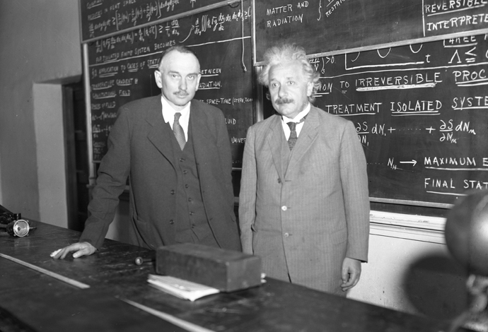

# How do we feel?

* Steep hills to climb
* Feeling of mastery on top of hills
  - Want another one! And another. And one too many.
  - Team mates are still down there?
* Some hill tops not worth effort
  - The ones that are are great
* Thin line between brilliance and mysticism

<table>
<tr>
<td>

</td>
<td>

</td>
</tr>
<table>
